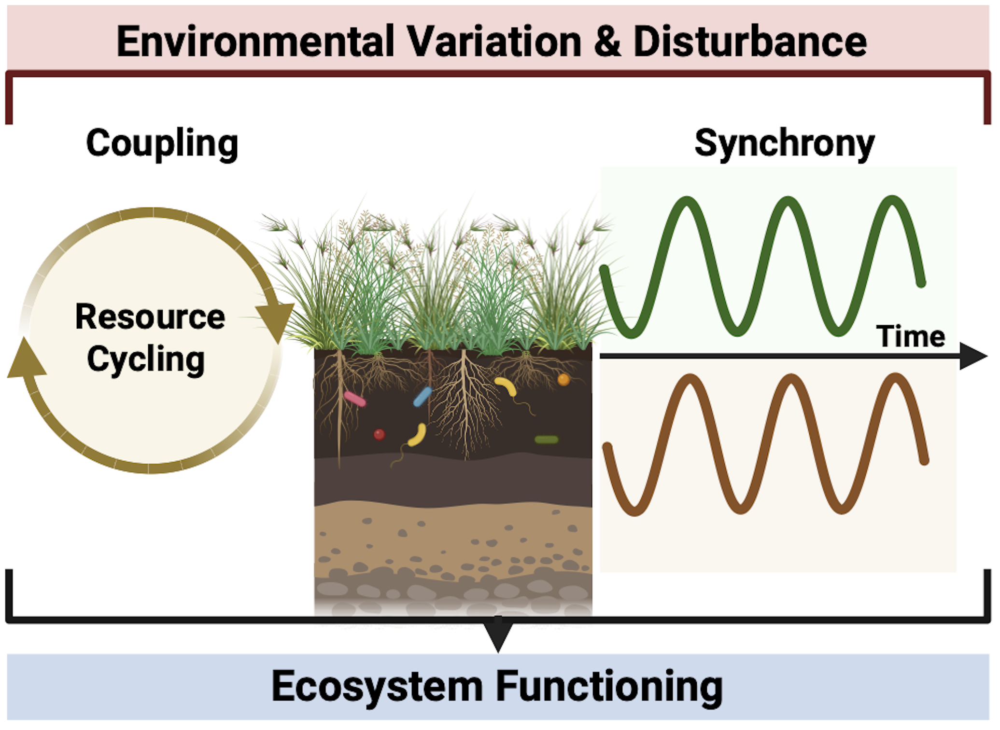

# Above-Belowground Coupling

Investigators:
- Ashley Bulseco
- Abigail Borgmeier
- Francis Chaves Rodriguez
- L. McKinley Nevins
- Smriti Pehim Limbu

## Project description

### Question
Are aboveground plant and belowground microbial communities synchronous or decoupled in response to global change drivers?

### Rationale
Above and belowground communities are critical in supporting multiple ecosystem services such as carbon sequestration, soil fertility and food production. The conservation of aboveground plant and belowground microbial communities is an urgent priority. However, given that these communities interact dynamically, and often nonlinearly, the consequences of their association cannot be understood in isolation. The direction and magnitude of plant and microbial responses to environmental change are highly context-dependent, varying across space, time, and ecological gradients. Thus, synthesis of spatiotemporally paired data of above-belowground communities is urgently needed to improve understanding of full ecosystem responses to global change drivers. 

### Approach
- Search data repositories and primary literature to identify spatially paired datasets of communities across time
    - Focused on plant (aboveground) and soil microbial communities (belowground) across different ecosystems focused         particularly on forest, grassland, desert, coastal and tundra.
- Evaluate the coverage of existing datasets in networks such as the LTER and NEON, and across ecosystem types. 
    - Community properties that we intend to evaluate: richness, evenness, diversity, dominance, biomass.
    - Ecosystem functioning metrics, such as biomass, productivity, etc. 

### Implications
- Development of a dataset of paired above-belowground community data essential to assess questions related to the synchrony and coupling of components. 
- More comprehensive understanding of the responses of ecosystems to global change drivers, through evaluating above and belowground communities in tandem.
- Identification of knowledge gaps in the monitoring of above-belowground communities across space and time. 

## Supplementary Resources

LTER Scientific Computing Team [website](https://lter.github.io/scicomp/) & NCEAS' [Resources for Working Groups](https://www.nceas.ucsb.edu/working-group-resources)
