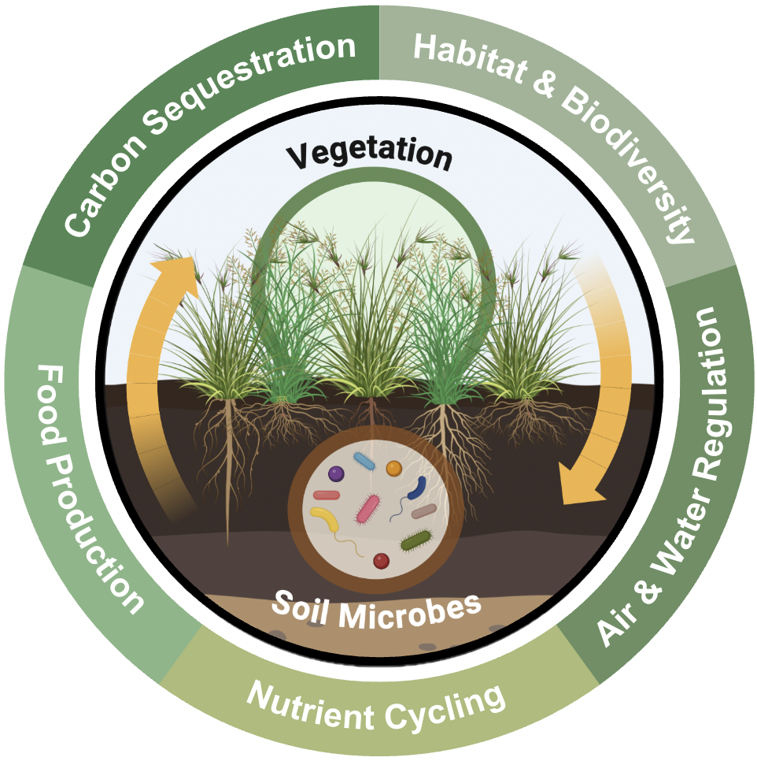

# Above-Belowground Coupling

This working group is part of the LTER's Synthesis Skills for Early Career Researchers course [website](https://lter.github.io/ssecr/)

**Investigators:**
- Ashley Bulseco1 - LTER: Plum Island Ecosystems
- Abigail Borgmeier2 - LTER: McMurdo Dry Valleys & Sevilleta
- Francis Chaves Rodriguez3 - LTER: Konza Prairie
- L. McKinley Nevins4 - LTER: Andrews Forest
- Smriti Pehim Limbu5 - LTER: Konza Prairie

**Project Mentors:**
- Serita Frey6 - LTER: Harvard Forest
- Meghan Avolio7 - LTER: Konza Prairie

**Affiliations:**
1. University of New Hampshire, College of Life Sciences and Agriculture, Durham, NH 03824
2. Brigham Young University, College of Life Sciences, Provo, UT 84602
3. Colorado State University, Department of Biology, Fort Collins, CO 80523
4. Washington State University, School of Biological Sciences, Pullman, WA 99164
5. Dartmouth College, Environmental Studies, Hanover, NH 03766
6. University of New Hampshire, Natural Resources and the Environment, Durham, NH 03824
7. Johns Hopkins University, Department of Earth and Planetary Sciences, Baltimore, MD 21218

## Project description

### Rationale
Above and belowground communities are critical in supporting multiple ecosystem services such as carbon sequestration, nutrient cycling and food production. The conservation of aboveground plant and belowground microbial communities is an urgent priority. However, given that these communities interact dynamically, and often nonlinearly, the consequences of their association cannot be understood in isolation. The direction and magnitude of plant and microbial responses to environmental change are highly context-dependent, varying across space, time, and ecological gradients. Thus, synthesis of spatiotemporally paired data of above-belowground communities is urgently needed to improve understanding of full ecosystem responses to global change drivers. 

### Question
**Are aboveground plant and belowground microbial communities synchronous or decoupled in response to global change drivers?**

### Key Definitions
**Synchrony:** is the similarity in temporal fluctuations of a given ecosystem function or property among different ecosystem components such as above and belowground communities. 

**Coupling:** is the absolute value of the pairwise association or correlation among constituents of the ecosystem. These constituents are fundamentally linked by fluxes of energy and matter (resources) through the system.  

### Approach
In order to adequately assess the synchrony and coupling of above and belowground components, spatially paired data of communities monitored across ecologically-relevant timescales is essential. 
- Search data repositories and primary literature to identify spatially paired datasets of communities across time
    - Focused on plant (aboveground) and soil microbial communities (belowground) across different ecosystems focused particularly on forest, grassland, desert, coastal and tundra.
- Evaluate the coverage of existing datasets in networks such as the LTER and NEON, and across ecosystem types. 
    - Community properties that we intend to evaluate: richness, evenness, diversity, dominance, biomass.
    - Ecosystem functioning metrics, such as biomass, productivity, etc. 

### Implications
- Development of a dataset of paired above-belowground community data essential to assess questions related to the synchrony and coupling of components. 
- More comprehensive understanding of the responses of ecosystems to global change drivers, through evaluating above and belowground communities in tandem.
- Identification of knowledge gaps in the monitoring of above-belowground communities across space and time. 

## Supplementary Resources

LTER Scientific Computing Team [website](https://lter.github.io/scicomp/) & NCEAS' [Resources for Working Groups](https://www.nceas.ucsb.edu/working-group-resources)
